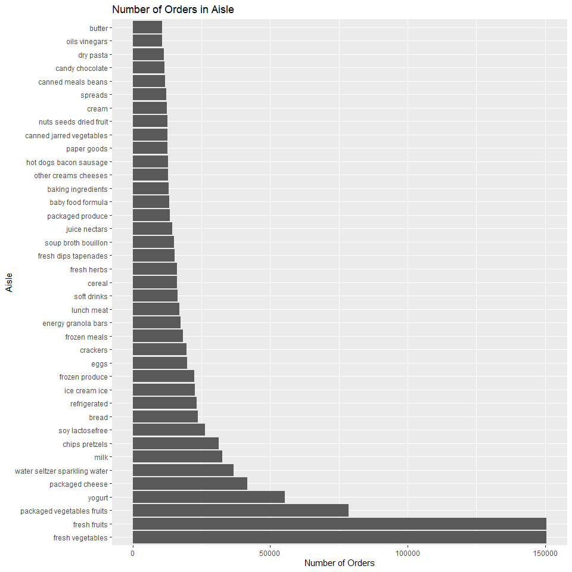
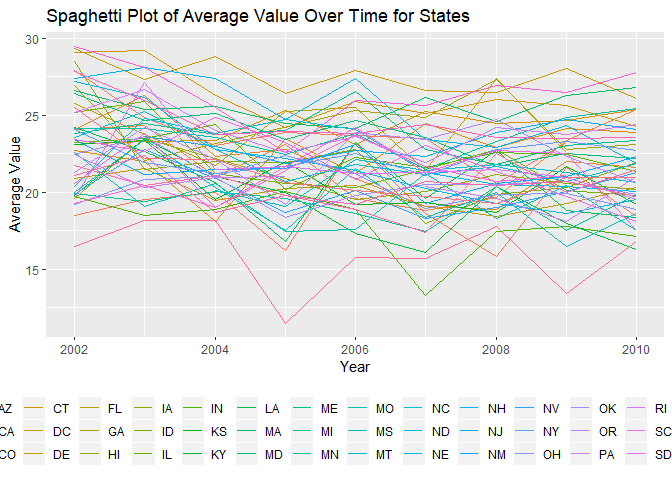

Homework 3
================
Elise Mantell
2019-10-14

### Problem 1

``` r
library(p8105.datasets) 
data("instacart") 
```

#### The goal is to do some exploration of this dataset. To that end, write a short description of the dataset, noting the size and structure of the data, describing some key variables, and giving illstrative examples of observations.

``` r
str(instacart)
```

    ## Classes 'tbl_df', 'tbl' and 'data.frame':    1384617 obs. of  15 variables:
    ##  $ order_id              : int  1 1 1 1 1 1 1 1 36 36 ...
    ##  $ product_id            : int  49302 11109 10246 49683 43633 13176 47209 22035 39612 19660 ...
    ##  $ add_to_cart_order     : int  1 2 3 4 5 6 7 8 1 2 ...
    ##  $ reordered             : int  1 1 0 0 1 0 0 1 0 1 ...
    ##  $ user_id               : int  112108 112108 112108 112108 112108 112108 112108 112108 79431 79431 ...
    ##  $ eval_set              : chr  "train" "train" "train" "train" ...
    ##  $ order_number          : int  4 4 4 4 4 4 4 4 23 23 ...
    ##  $ order_dow             : int  4 4 4 4 4 4 4 4 6 6 ...
    ##  $ order_hour_of_day     : int  10 10 10 10 10 10 10 10 18 18 ...
    ##  $ days_since_prior_order: int  9 9 9 9 9 9 9 9 30 30 ...
    ##  $ product_name          : chr  "Bulgarian Yogurt" "Organic 4% Milk Fat Whole Milk Cottage Cheese" "Organic Celery Hearts" "Cucumber Kirby" ...
    ##  $ aisle_id              : int  120 108 83 83 95 24 24 21 2 115 ...
    ##  $ department_id         : int  16 16 4 4 15 4 4 16 16 7 ...
    ##  $ aisle                 : chr  "yogurt" "other creams cheeses" "fresh vegetables" "fresh vegetables" ...
    ##  $ department            : chr  "dairy eggs" "dairy eggs" "produce" "produce" ...
    ##  - attr(*, "spec")=
    ##   .. cols(
    ##   ..   order_id = col_integer(),
    ##   ..   product_id = col_integer(),
    ##   ..   add_to_cart_order = col_integer(),
    ##   ..   reordered = col_integer(),
    ##   ..   user_id = col_integer(),
    ##   ..   eval_set = col_character(),
    ##   ..   order_number = col_integer(),
    ##   ..   order_dow = col_integer(),
    ##   ..   order_hour_of_day = col_integer(),
    ##   ..   days_since_prior_order = col_integer(),
    ##   ..   product_name = col_character(),
    ##   ..   aisle_id = col_integer(),
    ##   ..   department_id = col_integer(),
    ##   ..   aisle = col_character(),
    ##   ..   department = col_character()
    ##   .. )

``` r
count(instacart, aisle) %>% ungroup() %>% arrange(desc(n))
```

    ## # A tibble: 134 x 2
    ##    aisle                              n
    ##    <chr>                          <int>
    ##  1 fresh vegetables              150609
    ##  2 fresh fruits                  150473
    ##  3 packaged vegetables fruits     78493
    ##  4 yogurt                         55240
    ##  5 packaged cheese                41699
    ##  6 water seltzer sparkling water  36617
    ##  7 milk                           32644
    ##  8 chips pretzels                 31269
    ##  9 soy lactosefree                26240
    ## 10 bread                          23635
    ## # ... with 124 more rows

##### *This dataset includes information about instacart orders, including items ordered, when they were ordred, and what aisle or department they come from. There are 1384617 observations of 15 variables. There are 134 aisles and the aisle with the most orders is the fresh vegetables aisle.*

#### Make a plot that shows the number of items ordered in each aisle, limiting this to aisles with more than 10000 items ordered. Arrange aisles sensibly, and organize your plot so others can read it.

``` r
instacart %>%
count(aisle) %>% 
filter(n > 10000) %>% 
mutate(aisle = forcats::fct_reorder(aisle, n, .desc = TRUE)) %>% 
ggplot(aes(x = aisle, y = n)) + coord_flip() +
geom_bar(stat = "identity") +
labs(title = "Number of Orders in Aisle",
       x = "Aisle",
       y = "Number of Orders")
```

<!-- -->

##### *By far the aisles with the most orders are healthy (fruits, vegetables, and yogurt among the top 4).*

#### Make a table showing the three most popular items in each of the aisles “baking ingredients”, “dog food care”, and “packaged vegetables fruits”. Include the number of times each item is ordered in your table.

``` r
instacart %>% 
  filter(aisle %in% c("baking ingredients", "dog food care", "packaged vegetables fruits")) %>% 
  group_by(aisle, product_name) %>% 
  summarize(n = n()) %>% 
  top_n(3) %>% 
  arrange(desc(n)) %>%
  rename("Aisle" = aisle, "Product" = product_name,  "Number of Orders" = n) %>% 
  knitr::kable()
```

    ## Selecting by n

| Aisle                      | Product                                       | Number of Orders |
| :------------------------- | :-------------------------------------------- | ---------------: |
| packaged vegetables fruits | Organic Baby Spinach                          |             9784 |
| packaged vegetables fruits | Organic Raspberries                           |             5546 |
| packaged vegetables fruits | Organic Blueberries                           |             4966 |
| baking ingredients         | Light Brown Sugar                             |              499 |
| baking ingredients         | Pure Baking Soda                              |              387 |
| baking ingredients         | Cane Sugar                                    |              336 |
| dog food care              | Snack Sticks Chicken & Rice Recipe Dog Treats |               30 |
| dog food care              | Organix Chicken & Brown Rice Recipe           |               28 |
| dog food care              | Small Dog Biscuits                            |               26 |

##### *The most commonly ordered packaged vegetables or fruits are all organic (spinach, raspberries, and blueberries). The second most commonly ordered dog food care item also appears to be organic. The most commonly ordered baking ingredients includes two types of sugar.*

#### Make a table showing the mean hour of the day at which Pink Lady Apples and Coffee Ice Cream are ordered on each day of the week; format this table for human readers (i.e. produce a 2 x 7 table)

``` r
instacart %>% 
filter(product_name %in% c("Pink Lady Apples", "Coffee Ice Cream")) %>% 
  select(product_name, order_dow, order_hour_of_day) %>% 
  mutate(dow_name = recode(order_dow, 
                      '1' = "Mon",
                      '2' = "Tues",
                      '3' = "Wed",
                      '4'  = "Thurs",
                      '5' = "Fri",
                      '6' = "Sat",
                      '0' = "Sun")) %>% 
  group_by(product_name, order_dow) %>% 
  summarize(mean_hour = round(mean(order_hour_of_day))) %>%
  spread(key = order_dow, value = mean_hour) %>% 
  rename("Product" = product_name) %>% 
  knitr::kable()
```

| Product          |  0 |  1 |  2 |  3 |  4 |  5 |  6 |
| :--------------- | -: | -: | -: | -: | -: | -: | -: |
| Coffee Ice Cream | 14 | 14 | 15 | 15 | 15 | 12 | 14 |
| Pink Lady Apples | 13 | 11 | 12 | 14 | 12 | 13 | 12 |

##### *People, on average, don’t vary the time of day they order either apples or ice cream depending on the day of the week by more than about 3 hours.*

### Problem 2

#### Focus on the “Overall Health” topic. Include only responses from “Excellent” to “Poor”. Organize responses as a factor taking levels ordered from “Poor” to “Excellent”

``` r
brfss = p8105.datasets::brfss_smart2010 %>% 
janitor::clean_names() %>% 
rename(state = locationabbr, county = locationdesc) %>% 
filter(topic == "Overall Health") %>% 
mutate(response = forcats::fct_relevel(response, c("Excellent", "Very good", "Good", "Fair", "Poor")))
```

#### In 2002, which states were observed at 7 or more locations? What about in 2010?

``` r
brfss %>% 
  filter(year == 2002) %>% 
  distinct(state, county) %>% 
  count(state) %>% 
  filter(n >= 7) 
```

    ## # A tibble: 6 x 2
    ##   state     n
    ##   <chr> <int>
    ## 1 CT        7
    ## 2 FL        7
    ## 3 MA        8
    ## 4 NC        7
    ## 5 NJ        8
    ## 6 PA       10

##### *Six states were observed at more than 7 locations in 2002, two in the south (FL and NC) and the remaining in the northeast (CT, MA, NJ, PA).*

``` r
brfss %>% 
  filter(year == 2010) %>% 
  distinct(state, county) %>% 
  count(state) %>% 
  filter(n >= 7) 
```

    ## # A tibble: 14 x 2
    ##    state     n
    ##    <chr> <int>
    ##  1 CA       12
    ##  2 CO        7
    ##  3 FL       41
    ##  4 MA        9
    ##  5 MD       12
    ##  6 NC       12
    ##  7 NE       10
    ##  8 NJ       19
    ##  9 NY        9
    ## 10 OH        8
    ## 11 PA        7
    ## 12 SC        7
    ## 13 TX       16
    ## 14 WA       10

##### *Fourteen different states were observed at more than 7 locations in 2010, four in the south (FL, NC, SC, TX), the majority in the northeast (MA, MD, PA, NJ, NY, and PA), and the remaining in the west (CO, WA, OH, NE).*

#### Construct a dataset that is limited to Excellent responses, and contains, year, state, and a variable that averages the data\_value across locations within a state.

``` r
brfss_new = brfss %>% 
janitor::clean_names() %>% 
filter(response == "Excellent") %>% 
group_by(state, year) %>% 
summarise(avg_data_value = mean(data_value))
```

#### Make a “spaghetti” plot of this average value over time within a state (that is, make a plot showing a line for each state across years – the geom\_line geometry and group aesthetic will help).

``` r
brfss_new %>% 
  group_by(state, year) %>% 
  ggplot(aes(x = year, y = avg_data_value)) + 
    geom_line(aes(color = state)) + 
    labs(title = "Spaghetti Plot of Average Value Over Time for States",
         x = "Year", 
         y = "Average Value") + 
    theme(legend.position = "bottom", 
          legend.direction = "horizontal") + 
    guides(color = guide_legend(ncol = 17))
```

    ## Warning: Removed 3 rows containing missing values (geom_path).

<!-- -->

##### *This is terribly difficult to read with so many states. I have no meaningful comments, but it is quite pretty in my humble opinion.*

#### Make a two-panel plot showing, for the years 2006, and 2010, distribution of data\_value for responses (“Poor” to “Excellent”) among locations in NY State

``` r
brfss %>% 
  filter(state == "NY") %>%
  filter(year == "2006" | year == "2010") %>%
  select(year, data_value, county, response) %>%
  mutate(data_value = as.numeric(data_value), year = as.factor(year), county = as.factor(county)) %>%
  ggplot(aes(x = response, y = data_value)) + 
  geom_boxplot() + facet_grid(. ~year)
```

<!-- -->

### Problem 3

#### Load, tidy, and otherwise wrangle the data. Your final dataset should include all originally observed variables and values; have useful variable names; include a weekday vs weekend variable; and encode data with reasonable variable classes. Describe the resulting dataset (e.g. what variables exist, how many observations, etc).

``` r
accel_data = read_csv("./data/accel_data.csv") %>%
  janitor::clean_names() %>%
  mutate(day_type = ifelse(day == "Saturday" | day == "Sunday", "Weekend", "Weekday"))
```

    ## Parsed with column specification:
    ## cols(
    ##   .default = col_double(),
    ##   day = col_character()
    ## )

    ## See spec(...) for full column specifications.

##### *The dataset includes 35 observations of 1444 variables.*

#### Traditional analyses of accelerometer data focus on the total activity over the day. Using your tidied dataset, aggregate accross minutes to create a total activity variable for each day, and create a table showing these totals. Are any trends apparent?

``` r
accel_data_tot = 
accel_data %>%
mutate(tot_daily_activity = rowSums(.[4:1443]))
```

``` r
accel_data_tot %>%  
group_by(week, day, tot_daily_activity) %>% 
select(week, day, tot_daily_activity) %>%
knitr::kable()
```

| week | day       | tot\_daily\_activity |
| ---: | :-------- | -------------------: |
|    1 | Friday    |            480542.62 |
|    1 | Monday    |             78828.07 |
|    1 | Saturday  |            376254.00 |
|    1 | Sunday    |            631105.00 |
|    1 | Thursday  |            355923.64 |
|    1 | Tuesday   |            307094.24 |
|    1 | Wednesday |            340115.01 |
|    2 | Friday    |            568839.00 |
|    2 | Monday    |            295431.00 |
|    2 | Saturday  |            607175.00 |
|    2 | Sunday    |            422018.00 |
|    2 | Thursday  |            474048.00 |
|    2 | Tuesday   |            423245.00 |
|    2 | Wednesday |            440962.00 |
|    3 | Friday    |            467420.00 |
|    3 | Monday    |            685910.00 |
|    3 | Saturday  |            382928.00 |
|    3 | Sunday    |            467052.00 |
|    3 | Thursday  |            371230.00 |
|    3 | Tuesday   |            381507.00 |
|    3 | Wednesday |            468869.00 |
|    4 | Friday    |            154049.00 |
|    4 | Monday    |            409450.00 |
|    4 | Saturday  |              1440.00 |
|    4 | Sunday    |            260617.00 |
|    4 | Thursday  |            340291.00 |
|    4 | Tuesday   |            319568.00 |
|    4 | Wednesday |            434460.00 |
|    5 | Friday    |            620860.00 |
|    5 | Monday    |            389080.00 |
|    5 | Saturday  |              1440.00 |
|    5 | Sunday    |            138421.00 |
|    5 | Thursday  |            549658.00 |
|    5 | Tuesday   |            367824.00 |
|    5 | Wednesday |            445366.00 |

##### *There does not appear to be strong trends relating to either week number or day of the week.*

#### Accelerometer data allows the inspection activity over the course of the day. Make a single-panel plot that shows the 24-hour activity time courses for each day and use color to indicate day of the week. Describe in words any patterns or conclusions you can make based on this graph.

``` r
accel_data_tot_hours = 
accel_data_tot %>%
mutate(H1 = rowSums(.[4:63])) %>%
mutate(H2 = rowSums(.[64:123])) %>%
mutate(H3 = rowSums(.[124:183])) %>%
mutate(H4 = rowSums(.[184:243])) %>%
mutate(H5 = rowSums(.[244:303])) %>%
mutate(H6 = rowSums(.[304:363])) %>%
mutate(H7 = rowSums(.[364:423])) %>%
mutate(H8 = rowSums(.[424:483])) %>%
mutate(H9 = rowSums(.[484:543])) %>%
mutate(H10 = rowSums(.[544:603])) %>%
mutate(H11 = rowSums(.[604:663])) %>%
mutate(H12 = rowSums(.[664:723])) %>%
mutate(H13 = rowSums(.[724:783])) %>%
mutate(H14 = rowSums(.[784:843])) %>%
mutate(H15 = rowSums(.[844:903])) %>%
mutate(H16 = rowSums(.[904:963])) %>%
mutate(H17 = rowSums(.[964:1023])) %>%
mutate(H18 = rowSums(.[1024:1083])) %>%
mutate(H19 = rowSums(.[1084:1143])) %>%
mutate(H20 = rowSums(.[1144:1203])) %>%
mutate(H21 = rowSums(.[1204:1263])) %>%
mutate(H22 = rowSums(.[1264:1323])) %>%
mutate(H23 = rowSums(.[1324:1383])) %>%
mutate(H24 = rowSums(.[1384:1443])) %>%
pivot_longer(H1:H24, 
  names_to = "hour", values_to = "aph") 
```
